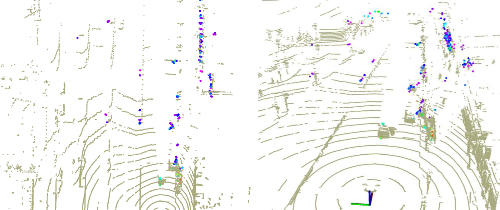

# Radar4Motion: IMU-Free 4D Radar Odometry with Robust Dynamic Filtering and RCS-Weighted Matching
Codes for paper "*Radar4Motion: IMU-Free 4D Radar Odometry with Robust Dynamic Filtering and RCS-Weighted Matching*"

Radar4Motion is a robust odometry method that utilizes Doppler and RCS information from the 4D imaging radar's point cloud, even in the presence of noisy and sparse point cloud data.

The code will be uploaded after the review process!

## Demo

 
<b>32ch LiDAR (beige) vs. 4D Imaging Radar (rainbow)</b>

 
<b>View-of-Delft Dataset Seq 03</b>

 
<b>View-of-Delft Dataset Seq 17</b>

- The above `gif` shows **ONLY** odometry-based mapping results.
    - *NO inertial sensor, NO GNSS sensor, NO loop-closure*
    - **Only Single front-view 4D Imaging Radar!**

## Contact

If you have any questions, please let me know:
- Soyeong Kim (`soyeongkim@hanyang.ac.kr`)

## Acknowledgement

- In the development of this package, we refer to [KISS-ICP](https://github.com/PRBonn/kiss-icp) and [REVE](https://github.com/christopherdoer/reve) for source codes.
- Dataset: [*View-of-Delft (VoD)*](https://github.com/tudelft-iv/view-of-delft-dataset)
- Evaluation: [evo](https://github.com/MichaelGrupp/evo) package for odometry evaluation
