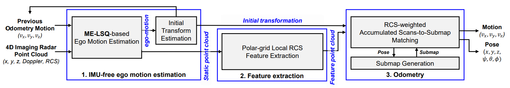

    

**IMPORTANT**: This repository has been accepted for publication in T-IV!🔥
The code is currently being organized and is scheduled for upload by the end of this year. Thank you!

# Radar4Motion: IMU-Free 4D Radar Odometry with Robust Dynamic Filtering and RCS-Weighted Matching

Radar4Motion is a robust odometry method that utilizes Doppler and RCS information from the 4D imaging radar's point cloud, even in the presence of noisy and sparse point cloud data.

 
<b>System architecture</b>

 

## Demo

 
<b>View-of-Delft Dataset Seq 03</b>

 
<b>View-of-Delft Dataset Seq 17</b>

- The above `gif` shows **ONLY** odometry-based mapping results.
    - *NO inertial sensor, NO GNSS sensor, NO loop-closure*
    - **Only Single front-view 4D Imaging Radar!**

## Contact

If you have any questions, please let me know:
- Soyeong Kim (`soyeongkim@hanyang.ac.kr`)

## Acknowledgement

- In the development of this package, we refer to [KISS-ICP](https://github.com/PRBonn/kiss-icp) and [REVE](https://github.com/christopherdoer/reve) for source codes.
- Dataset: [*View-of-Delft (VoD)*](https://github.com/tudelft-iv/view-of-delft-dataset)
- Evaluation: [evo](https://github.com/MichaelGrupp/evo) package for odometry evaluation
